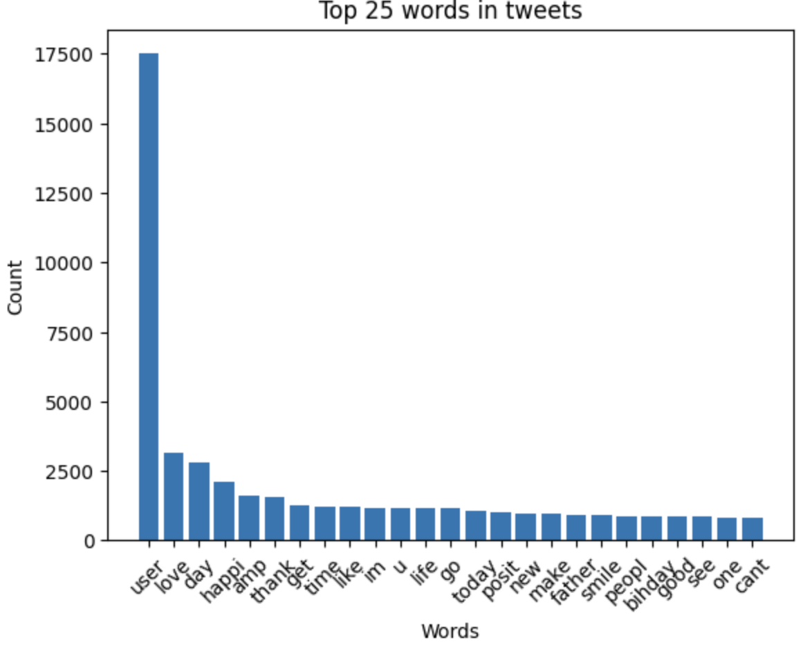
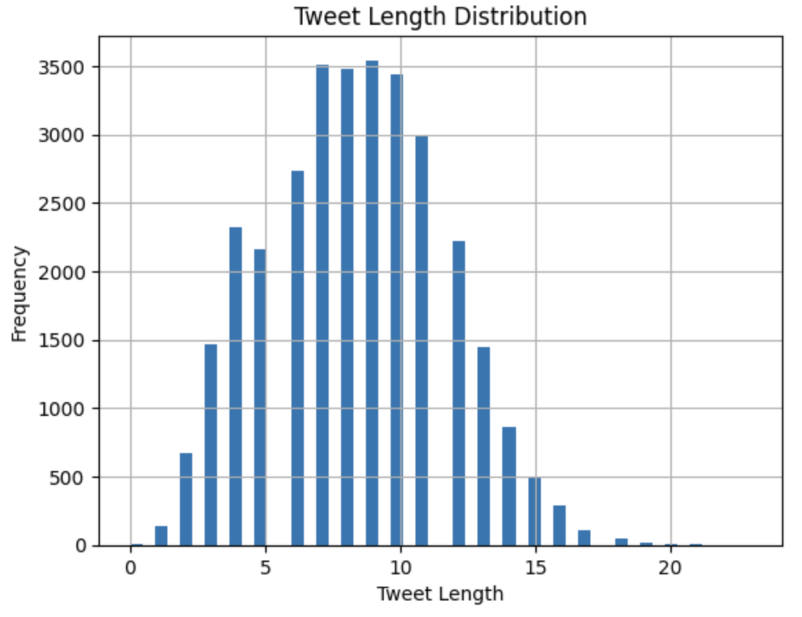
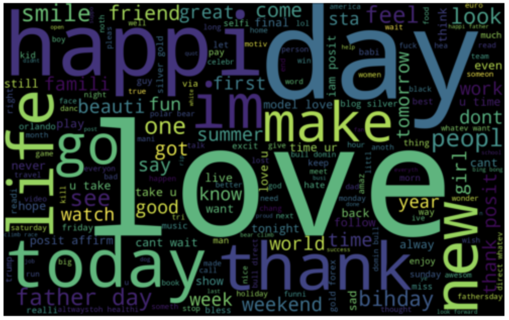
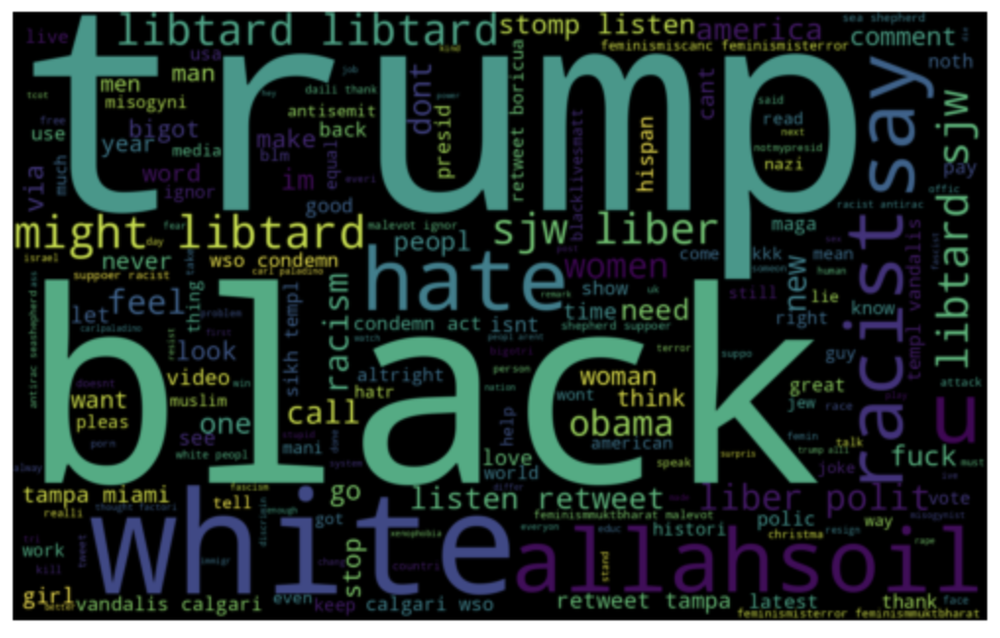
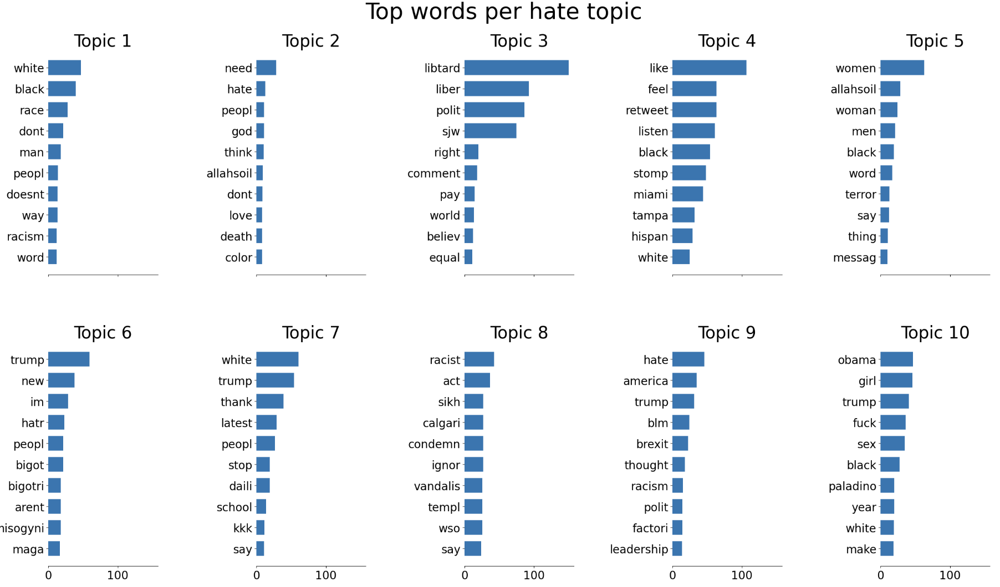
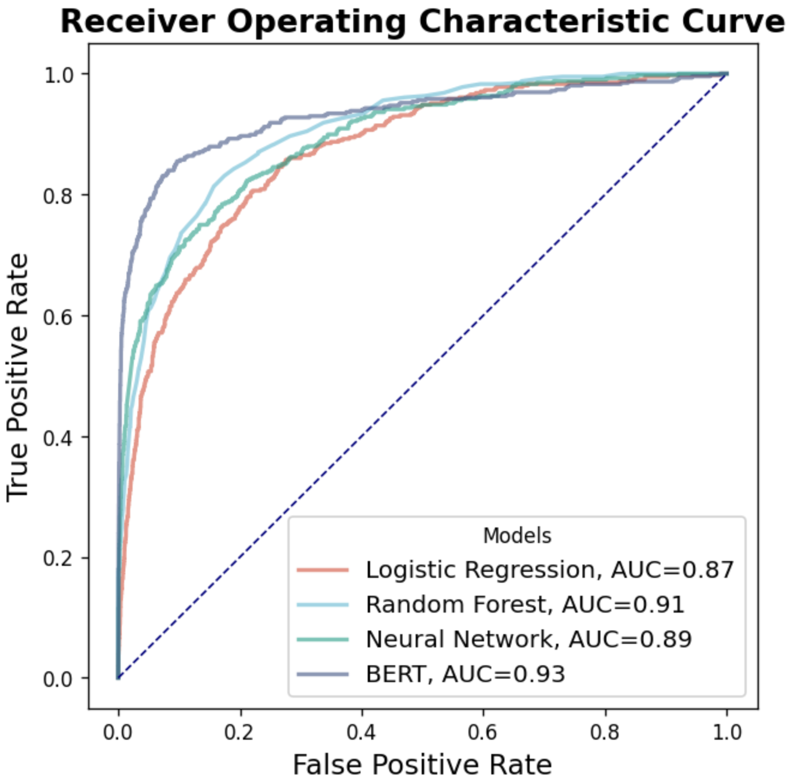

# Sentiment Analysis on Twitter

## Task: Classification

### Highlights
- Natural Language Processing (NLP)
- BERT
- Machine Learning
- Deep Learning
- Exploratory Data Analysis (EDA)

## Data Source
The dataset is sourced from [Kaggle](https://www.kaggle.com/datasets/vkrahul/twitter-hate-speech) and includes tweets from Twitter, labeled as positive (normal speech) or negative (hate speech).

- **Size**: 50k rows x 2 columns (2/3 for training, 1/3 for testing)
- **Description**: Each row represents a tweet and its corresponding classification as positive or negative.

## Approaches of Analysis

### Task
Using BERT encoder to vectorize the tweets, followed by classification using logistic regression, random forest, neural network, and BERT models to distinguish between normal speech and hate speech, aiming to improve the social media environment.

### Data Preprocessing
1. Convert to lowercase
2. Remove numbers
3. Remove punctuation
4. Remove whitespaces
5. Remove non-ASCII characters
6. Remove HTML characters
7. Tokenization
8. Remove stopwords
9. Stemming
10. Rejoin tokens

### Visualization
1. **Top 25 Words**
  
2. **Tweet Length Distribution**
  
3. **Word Clouds (General)**
  
4. **Word Clouds (Hate Speech)**
  
5. **Words of Hate Topics
  

### Models Used
Using BERT encoder to vectorize the tweets, followed by classification using logistic regression, random forest, neural network, and BERT models to distinguish between normal speech and hate speech, aiming to improve the social media environment.

### Evaluation
Plot ROC-AUC curve to evaluate the model performance. 
  

